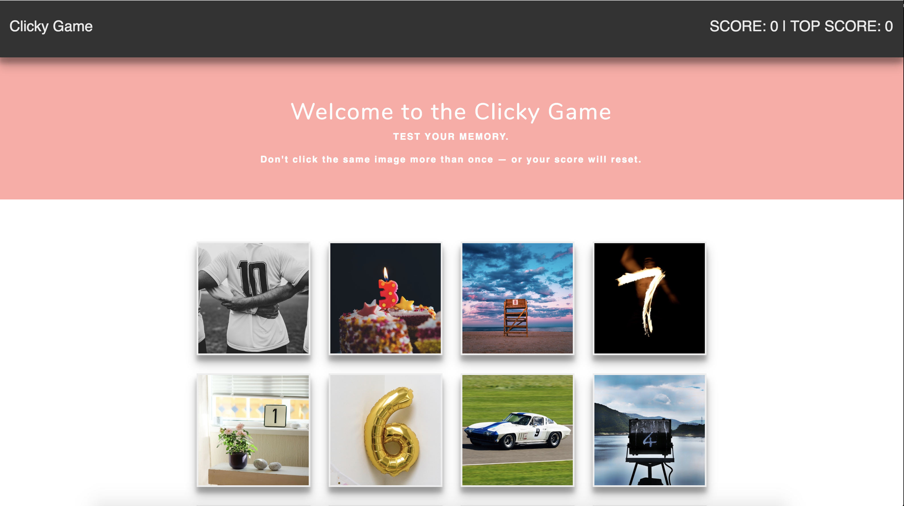

# React Memory Game

## Overview
- A Memory Game with React using 
    - UI COMPONENTS
    - MANAGED COMPONENT STATE
    - RESPONSE TO USER EVENTS

## Live Site
- https://secret-bastion-23513.herokuapp.com/

## Description

- Renders different images to the screen. Each image listens for click events.

- Track the user's score. 
    - Increments when clicking an image for the first time. 

    - The user's score resets to 0 if they click the same image more than once.

    - Once the user's score is reset after an incorrect guess, the game restarts.

    - Notify the user if they get the best possible score and reset the game.

    

- Every time an image is clicked, the images rendered to the page shuffle themselves in a random order.

